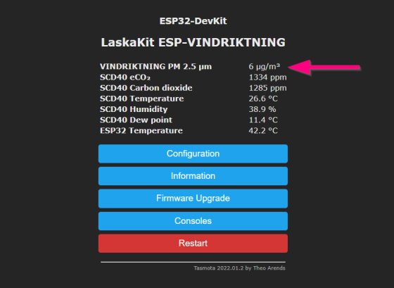

# Jak na otestování připraveného buildu

> Abyste nemuseli kompilovat Tasmota FW sami, najdete zde hotový build s podporou pro _LaskaKit ESP-VINDRIKTNING_. 
> \
> **V současnosti jsou úpravy v podobě beta verze. Budu rád za otestování a zpětnou vazbu.** 👋

## Flashování

Stáhněte poslední `tasmota-vindriktning.factory.bin` (v sekci **[Releases](https://github.com/ah01/Tasmota-Vindriktning/releases)**) a nahrajte ho do zařízení. Můžete použít libovolný způsob, který tasmota [uvádí v dokumentaci](https://tasmota.github.io/docs/Getting-Started/#flashing) a který umožňuje použít vlastní bin soubor.

Např. pro esptool použijte:

```bash
# před prvním použitím Tasmoty nebo pokud narazíte na problémy, smažte Flash paměť
esptool --port <port> --baud 921600 erase_flash

# Zapsání nového FW
esptool --port <port> --baud 921600 write_flash 0 tasmota-vindriktning.factory.bin
```

## Prvotní nastavení

### Wifi

Dokud máte zařízení připojené k PC, doporučuji rovnou nastavit i WiFi. Otevře váš oblíbený terminál s rychlostí 115200 a zadejte:

```
Backlog ssid1 <SSID>; password1 <Heslo>;
```

Zařízení se restartuje a mělo by se připojit na WiFi.

### Nastavení pinů

Tasmota FW potřebuje nyní vědět konfigurací pinů procesoru. 

Otevřete webové rozhraní. V sekci `Configuration | Configure Module` zadejte následující GPIO nastavení:

| GPIO | Funkce |
| ---- | -----  |
| 12 | Vindriktning FAN |
| 16 | Vindriktning RX |
| 17 | Vindriktning TX |
| 21 | I2C SDA |
| 22 | I2C SCL |
| 25 | WS2812 |


Po uložení se zařízení restartuje a mělo vy vás uvítat něco takového:



## Logování

Pokud narazíte na problém se senzorem prachových částic můžete zkusit zvýšit úroveň logování. V logu pak uvidíte zprávy začínající na `VINDRIKTNING:`

Úroveň logování jde měnit v sekci `Configuration | Configure Logging`. Potřeba je úroveň `4 More Logging`.
